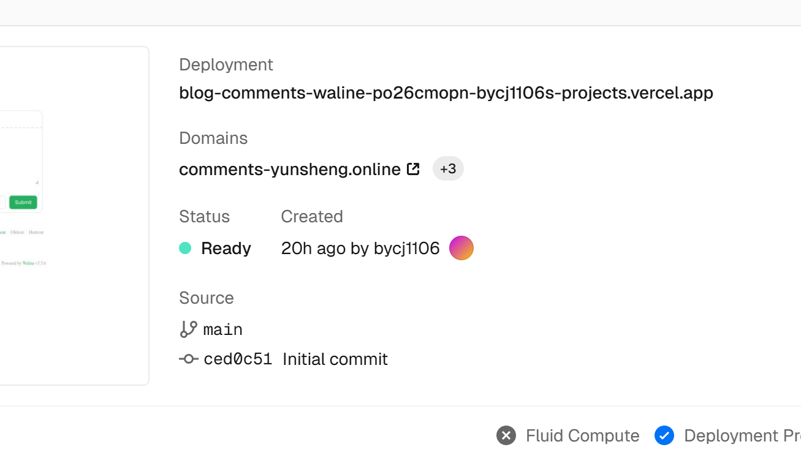
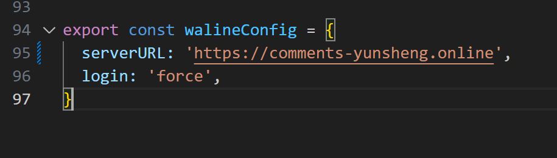
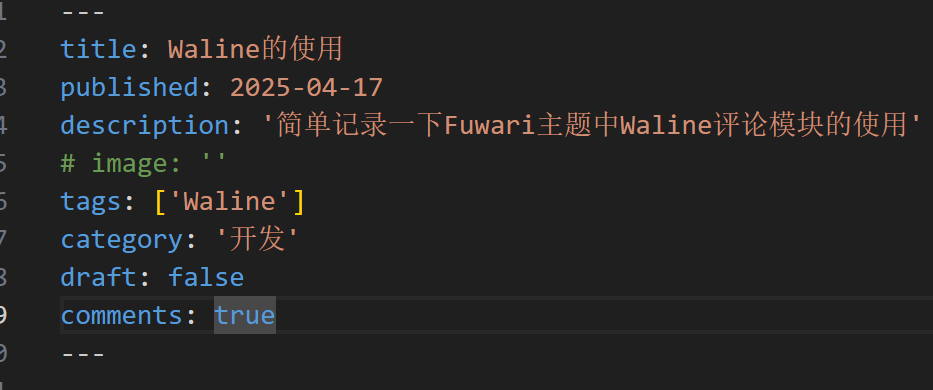

## 1. 部署 Waline 服务端

先照着[Waline官方文档](https://waline.js.org/guide/get-started/)把 `Waline` 项目给部署了，就完全照着操作就行了，官方文档写的很详细，我觉得没必要再重复写一次。一直照着操作到绑定域名为止，暂时没有必要绑定域名，如果有进行加速使国内可以访问的需求时再绑定域名（之后会写如何加速）。

记住部署好的 `Waline` 项目的 `Domains`，有需要的话可以先用我的做测试，已做国内加速，域名注册的话选有首年优惠的就行，大概10块钱左右，但是续费很贵，所以到期后我会更换新域名，所以还是需要你自己注册一个自己域名。

## 2. 配置前端

在 `src/config.ts` 中的 `walineConfig` 配置项里添入自己部署的 `Waline` 项目的域名。

## 3. 启用评论功能

然后在要启用评论系统的文章 `Front-matter` 中加入 `comments: true` 就可以单独对文章启用 `Waline` 评论了。

## 4. 管理员与管理面板

首个注册的账号会是管理员，管理面板在 `example.yourdomain.com/ui`

## 5. 国内访问加速

如果你使用 `Vercel` 部署 `Waline`，国内用户可能无法直接访问评论系统。需要加速的同学可以参考：[这篇文章](https://blog-yunsheng.cn/posts/old-post/vercel-cloudflare-twikoo/)

*如有疑问，欢迎留言交流！*