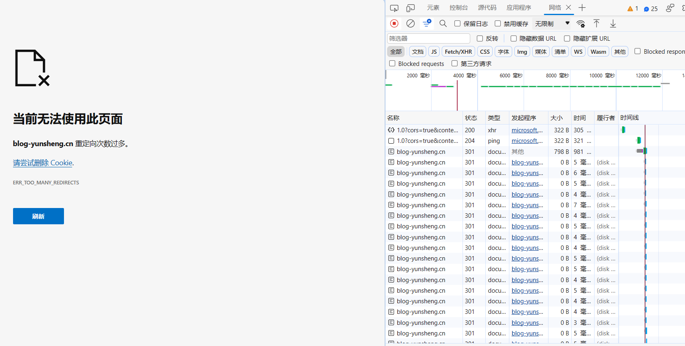
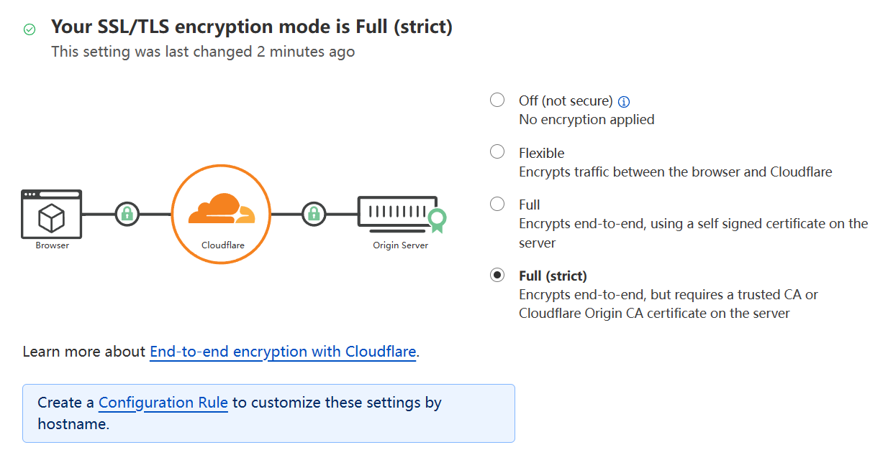

## 问题原因

源站开启了HTTP重定向至HTTPS的功能，并且CDN控制台上配置的回源端口为80。在这种情况下，由于CDN回源端口为80，客户端无论是通过HTTP还是HTTPS访问CDN加速域名时，CDN在回源的时候都是使用HTTP请求源站，此时会触发源站的HTTPS强制跳转逻辑，然后源站会要求CDN重新发送一个HTTPS的请求，但是CDN回源的时候仍然会发送HTTP回源请求，然后再进行跳转，以此类推，就会出现反复重定向问题，最终导致出现报错。

*可见无限301重定向的情况*

## 解决方法

查了一下相关资料，CloudFlare导致的重定向次数过多可以通过将“SSL/TLS 加密模式”设置为完全（Strict）解决。

其他产品的CDN可以通过将回源端口设置为443来解决，CDN回源时会以HTTPS协议请求源站，就不会触发源站的强制跳转逻辑。

另一种方法是将协议跟随回源设置为“跟随”。设置为跟随以后，源站发起HTTPS重定向以后，CDN回源协议跟随为HTTPS回源。

## 经验总结

自行用F12控制台分析网络连接情况，定位问题，然后查找相关资料。
