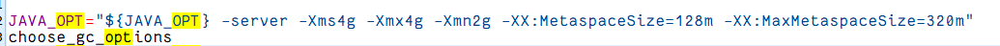
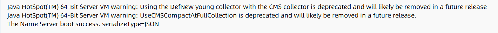

RocketMQ启动了将近一个小时，均无法启动，以失败告终，查了一堆文档，都没有找到解决方法，最后找到logs文件，里面记录了error原因，系JVM内存不足，于是才终于找到解决方法。

到bin文件夹下，修改runserver.sh、runbroker.sh、tools.sh三个文件中以下值：~~*默认设定为8g和4g，怪不得我的小破云服务器启动不起来，不是，就一个消息队列都这么吃内存吗？*~~

`JAVA_OPT="${JAVA_OPT} -server -Xms256m -Xmx256m -Xmn128m"`

*相关参数*

Xms 是指设定程序启动时占用内存大小。一般来讲，大点，程序会启动的快一点，但是也可能会导致机器暂时
间变慢。
Xmx 是指设定程序运行期间最大可占用的内存大小。如果程序运行需要占用更多的内存，超出了这个设置值， 
就会抛出OutOfMemory异常。
xmn 年轻代的heap大小，一般设置为Xmx的3、4分之一。

#### 成果

终于启动成功，但是似乎还有一些其他建议，与GC有关，暂时先忽略，等之后优化，仅此记录一下。
