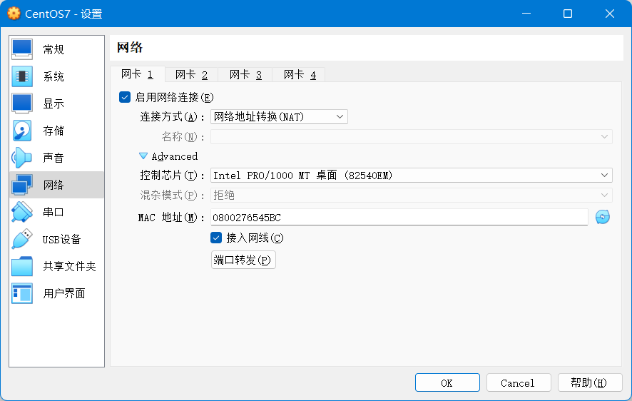
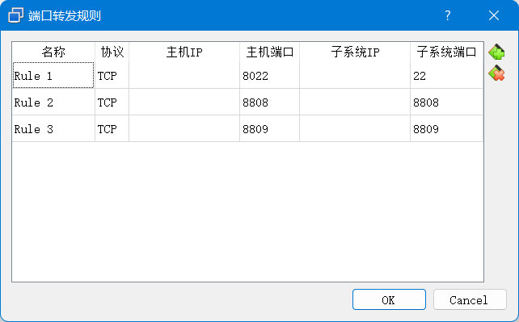
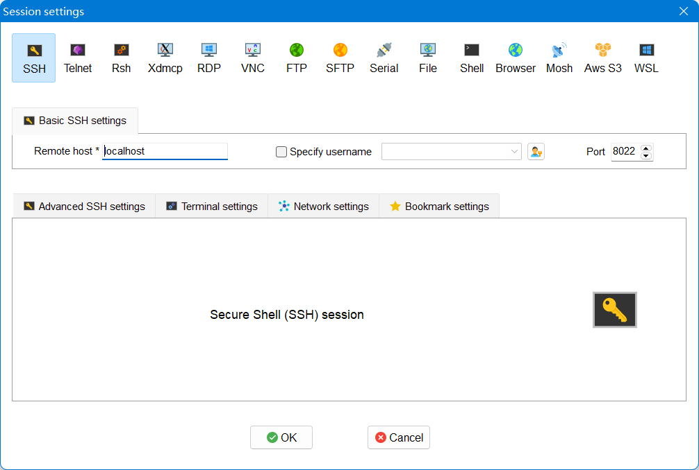

# 通过SSH连接虚拟机

## Oracle VM VirtualBox

## MobaXterm

# 连接其中Docker下的MySQL数据库

在Docker中成功启动MySQL，确认Docker中MySQL无问题。

在Oracle VM VirtualBox中给端口转发列表添加Docker中映射的端口。

在宿主机中打开cmd，用`ipconfig`查到虚拟机ip地址。

打开Navicat，输入对应信息即测试连接。
