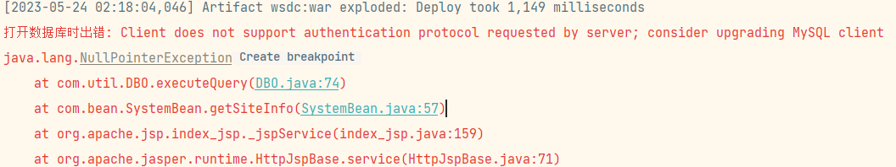
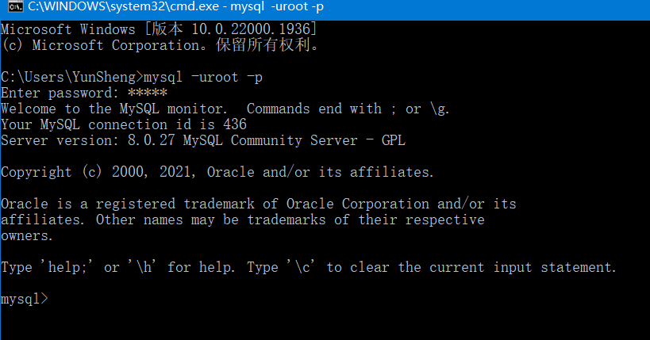
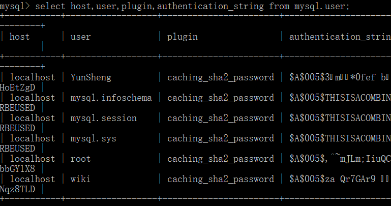

使用网上一些老旧的项目来完成课设时出现连接不上Mysql报错：



报错原因：mysql8 之前的版本中加密规则是mysql_native_password,而在mysql8之后,加密规则是caching_sha2_password

查看Mysql版本：



查看SQL用户信息：

`select host,user,plugin,authentication_string from mysql.user;
 `



修改密码：

```bash
ALTER USER 'root'@'localhost' IDENTIFIED WITH mysql_native_password BY '123456';
更新user为root，host为localhost 的密码为123456
```

参考文章：[Mysql 解决1251- Client does not support authentication protocol requested by server...的问题_慕城南风的博客-CSDN博客](https://blog.csdn.net/lovedingd/article/details/106728292)

****

***补充一个mysql8.0的连接问题***

网上有些项目用的是老版mysql，我个人电脑用的是mysql8.0.27版本，与老版项目jar包版本不符，需要更换对应版本jar包。

[MySQL :: Download MySQL Connector/J (Archived Versions)](https://downloads.mysql.com/archives/c-j/)

数据库配置文件：

```java
dataSource.driverClass=com.mysql.cj.jdbc.Driver
dataSource.jdbcUrl=jdbc:mysql://localhost:3306/ssm?useUnicode=true&characterEncoding=utf-8&useSSL=false&serverTimezone=UTC
```

