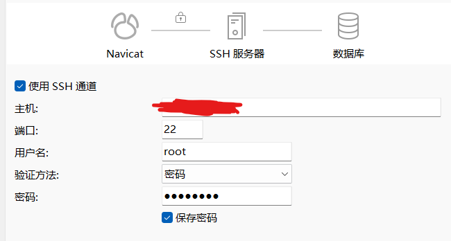

**Linux**

```bash
docker ps
docker exec -it [container name] /bin/bash
mysql -u -p
# 对远程连接进行授权
GRANT ALL ON *.* TO 'root'@'%';
# 刷新权限
flush privileges;
```

**云服务器实例**

在网卡中新建安全组，新增MySQL规则。


**Navicat**



