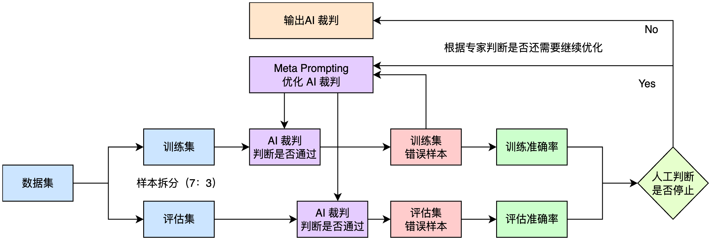

## 一、基础对话调用

### 1.1 核心代码实现

```python
from openai import OpenAI
import os
client = OpenAI(
    api_key=os.getenv("DASHSCOPE_API_KEY"),
    base_url="https://dashscope.aliyuncs.com/compatible-mode/v1",
)
def get_qwen_response(prompt):
    response = client.chat.completions.create(
        model="qwen-max",
        messages=[
            # system message 用于设置大模型的角色和任务
            {"role": "system", "content": "你负责教育内容开发公司的答疑，你的名字叫公司小蜜，你要回答同事们的问题。"},
            # user message 用于输入用户的问题
            {"role": "user", "content": prompt}
        ]
    )
    return response.choices[0].message.content
response = get_qwen_response("我们公司项目管理应该用什么工具")
print(response)
```

### 1.2 消息类型说明

| 角色 | 作用 |
|------|------|
| `system` | 设置大模型的角色和任务 |
| `user` | 用户输入的问题 |
| `assistant` | 模型回复 |

---

## 二、多轮对话

### 2.1 核心概念

多轮对话让大模型能够"记住"历史对话信息，理解上下文关联，从而给出连贯、准确的回复。

### 2.2 实现原理

在 `messages` 参数中保存完整的对话历史记录，每条消息包含 `role` 和 `content` 字段。大模型会根据所有历史消息来生成回复。

```python
def multi_turn_chat():
    # 初始化对话历史，包含系统提示词
    conversation_history = [
        {"role": "system", "content": "你负责教育内容开发公司的答疑，你的名字叫公司小蜜，你要回答同事们的问题。"}
    ]
    
    # 模拟多轮对话
    user_questions = [
        "我们公司项目管理应该用什么工具？",
        "那我怎么申请这个工具的账号呢？",
        "申请一般需要多久能批下来？"
    ]
    
    for question in user_questions:
        print(f"👤 用户：{question}")
        
        # 将用户问题添加到对话历史
        conversation_history.append({"role": "user", "content": question})
        
        # 调用大模型，传入完整的对话历史
        response = client.chat.completions.create(
            model="qwen-max",
            messages=conversation_history  # 包含所有历史消息
        )
        
        # 获取模型回复
        assistant_message = response.choices[0].message.content
        print(f"🤖 小蜜：{assistant_message}\n")
        
        # 将模型回复也添加到对话历史，以便下一轮对话使用
        conversation_history.append({"role": "assistant", "content": assistant_message})

multi_turn_chat()
```

---

## 三、流式输出

### 3.1 为什么需要流式输出？

默认情况下，API 需要等待模型生成完所有内容后才一次性返回结果（约20秒），影响用户体验。流式输出让模型一边思考一边输出，用户能立即看到部分回复。

### 3.2 实现方式

```python
def get_qwen_stream_response(user_prompt,system_prompt):
    response = client.chat.completions.create(
        model="qwen-max",
        messages=[
            {"role": "system", "content": system_prompt},
            {"role": "user", "content": user_prompt}
        ],
        stream=True
    )
    for chunk in response:
        yield chunk.choices[0].delta.content

response = get_qwen_stream_response(user_prompt="我们公司项目管理应该用什么工具",system_prompt="你负责教育内容开发公司的答疑，你的名字叫公司小蜜，你要回答同事们的问题。")
for chunk in response:
    print(chunk, end="")
```

> 💡 **提示**：流式输出只是改变展示方式，模型思考过程和答案质量保持不变。

---

## 四、大模型文本生成工作流程

### 4.1 流程概览

```
文本分词 → Token向量化 → 大模型推理 → 解码与自回归 → 输出文本
```

### 4.2 详细阶段

#### 第一阶段：文本分词（Tokenization）

计算机无法直接理解人类文字，需要将文本转换为 Token（分词）序列。每个 Token 对应词表中的一个整数 ID。

- Token 通常是子词片段或字符片段，不一定等于完整词语
- 英文可能被拆成词根和后缀，中文可能按字或词组切分

#### 第二阶段：Token 向量化

将离散 ID 转换为包含语义信息的向量表示。通过 Embedding 矩阵"查表"获取每个 token 的语义向量。

还需添加位置信息（Positional Encoding），让模型区分词语顺序。

#### 第三阶段：大模型推理

向量序列进入 Transformer 解码器层，通过因果自注意力机制和前馈神经网络进行处理。最终得到最后一个 token 的隐藏状态向量，通过线性投影层映射到词汇表维度得到 Logits。

#### 第四阶段：解码与自回归

- **Softmax**：将 logits 转换为概率分布 P(next_token | context)
- **解码策略**：
  - 近似确定性：贪心解码、Beam Search
  - 随机采样：Top-p（Nucleus Sampling）、Top-k Sampling

- **自回归生成**：将新 token 追加到输入序列，重复预测下一个 token，直到满足停止条件：
  - 生成 EOS 终止符
  - 达到最大生成长度
  - 生成用户指定的停用词

#### 第五阶段：输出文本

将 token ID 序列转换回人类可读的字符串。

---

## 五、影响生成随机性的参数

### 5.1 temperature（温度）

调节候选 Token 的概率分布，影响生成文本的多样性和创造性。

| 场景 | 建议值 |
|------|--------|
| 需要明确答案（代码生成） | 较低 |
| 需要创意多样（广告文案） | 较高 |
| 无特殊需求 | 默认值 |

> ⚠️ 当 temperature=0 时，虽降低随机性，但无法保证每次输出完全一致。

### 5.2 top_p（核采样）

按概率从高到低排序，选取累计概率达到设定阈值的 Token 组成候选集合。

| 值 | 效果 |
|----|------|
| 较大 | 候选范围广，内容更多样（创意写作） |
| 较小 | 候选范围窄，输出更稳定（新闻、代码） |

### 5.3 小结

- 建议不同时调整 `temperature` 和 `top_p`，以确保输出可控
- 即使设置 temperature=0、top_p=极小值、seed相同，仍可能存在微小随机性（分布式系统等因素导致）

---

## 六、私域知识问答

### 6.1 问题根源

大模型的知识来源于训练数据（公开互联网信息），无法直接回答公司内部文档、政策等私域问题。

### 6.2 初步方案：提示词中"喂"入知识

直接塞入背景知识可解决问题，但存在**核心瓶颈**：

- **上下文窗口有限**：无法一次性塞入大量文档
- **效率低**：上下文越长，处理时间越长
- **成本高**：按文本量计费
- **信息干扰**：无关信息会影响回答质量

### 6.3 解决之道：上下文工程（Context Engineering）

在正确的时间，将最相关、最精准的知识动态加载到有限的上下文窗口中。

**核心技术包括**：

| 技术 | 作用 |
|------|------|
| **RAG** | 从外部知识库检索信息 |
| **Prompt** | 精心设计指令引导模型 |
| **Tool** | 调用外部工具获取实时信息 |
| **Memory** | 建立长短期记忆机制 |

---

## 七、RAG（检索增强生成）

### 7.1 核心思想

不再将全部知识库硬塞给大模型，而是**先检索、后生成**：
1. 自动检索与问题最相关的私有知识片段
2. 将片段与用户问题合并后传给大模型
3. 生成最终答案

### 7.2 实现阶段

#### 第一阶段：建立索引

1. 将私有知识文档分割为片段
2. 使用 Embedding 模型将文本转化为向量
3. 存储到向量数据库，保留语义信息

#### 第二阶段：检索与生成

1. 用户提问时，将问题转化为向量
2. 在向量数据库中检索相似片段
3. 将相关片段与问题一同输入大模型
4. 生成最终回答

### 7.3 RAG 优势

- ✅ 避免上下文过长导致的问题
- ✅ 提高输出准确性与相关性
- ✅ 降低使用成本
- ✅ 支持大规模知识库

---

## 知识脉络图

```
大模型基础调用
    ├── 单轮对话
    ├── 多轮对话（记忆上下文）
    └── 流式输出（用户体验优化）

    ↓
    
大模型工作原理
    ├── 文本分词 → Token向量化
    ├── Transformer推理
    ├── 解码策略（贪心/采样）
    └── 自回归生成

    ↓
    
参数控制
    ├── temperature（多样性）
    ├── top_p（候选范围）
    └── seed（可复现性）

    ↓
    
私域知识问答
    └── 上下文工程
        ├── RAG（检索增强生成）
        ├── Prompt工程
        ├── 工具使用
        └── 记忆机制
```

---

> **学习心得**：成功的关键不在于"喂"给模型多少知识，而在于"喂"得有多准。上下文工程正是释放大模型潜力的关键所在。

RAG应用通常包含建立索引与检索生成两部分。

建立索引包括四个步骤：
1. 文档解析
2. 文本分段
3. 文本向量化
4. 存储索引

检索生成：
1. 检索
2. 生成

如果把完整的对话历史和问题一起输入检索系统，由于文本过长，embedding模型的效果会下降。业界通用的解决方案是：

1. 问题改写：利用大模型根据对话历史对当前问题进行改写，将上下文信息融入问题中
2. 正常检索：使用改写后的问题进行检索和生成


分隔符可以使大模型抓住具体的目标，避免模糊的理解，也减少对不必要信息的处理。分隔符一般可以选择 “【】”、“<< >>”、“###”来标识关键要素，用“===”、“—”来分隔段落，或者使用xml标签如<tag> </tag>来对特定段落进行标识。当然，分隔符不止上述提到的几种，只需要起到明确阻隔的作用即可。需要注意的是，如果提示词中已大量使用某种符号（如【】），则应避免用该符号作为分隔符，以防混淆。

一次性就写好一个完美的提示词，往往非常困难。更常见的工作流是：

1. 写出第一版提示词。
2. 运行它，并分析输出结果中有哪些不符合预期的地方。
3. 总结问题，思考如何改进，然后修改提示词。
4. 不断重复这个迭代过程，直到满意为止。

既然大模型这么强大，这个分析、总结、改进的迭代过程，是否能让大模型自己来做呢？ 让它扮演“提示词评审专家”的角色，帮助我们分析和优化提示词，无疑会更高效。

答案是肯定的。这种让你和模型一起“讨论”如何优化提示词本身的方法，就叫做 Meta Prompting。

```
我正在为公司的新员工答疑机器人优化一个提示词，目标是回答关于“公司福利”的问题。

这是我的第一个尝试：
---
{initial_prompt}
---

这是它生成的输出：
---
{response}
---

这个输出不够好。我希望机器人的回答更具吸引力，并且结构清晰，能让新员工快速抓住重点。具体要求如下：
1.  **语气**：友好、热情，有欢迎新同事的感觉。
2.  **结构**：使用清晰的要点（比如用表情符号开头的列表）来组织内容。
3.  **内容**：将福利分为几个类别，如“健康与假期”、“补贴与激励”等。

请你扮演一位提示词工程专家，帮我重写这个提示词，以实现上述目标。
```

在前面的例子中，你扮演了主导角色，接收“AI教练”的建议并手动应用它。但这个过程还可以进一步自动化和精确化。与其让评估者给出一个模糊的“好”或“不好”的判断，一个更高级的方法是引入一个 “参考答案”（Reference Answer）。

这个“参考答案”是你心目中最完美的理想答案，可以由人类专家撰写，也可以用一个非常详尽的提示词让最强大的模型生成。迭代优化的目标就变成了：不断修改提示词，使其生成的回答与这个“参考答案”之间的差距越来越小。

这个过程就像一个拥有精确制导系统的自我修正流程：

1. 设定参考答案 (Set Reference Answer)：首先，定义一个高质量的、理想的“参考答案”。
2. 生成 (Generate)：使用当前待优化的提示词，生成一个回答。
3. 分析差距 (Analyze Gap)：让一个“评估者”大模型（Critic）来比较“生成的回答”和“参考答案”，并输出一份详细的“差距分析报告”，指出两者在语气、结构、内容、格式等方面的具体差异。
4. 优化 (Optimize)：将“差距分析报告”连同原始提示词、生成的回答一起，交给一个“优化者”大模型（Optimizer）。它的任务是根据这份报告，重写提示词，以专门解决其中指出的问题，从而缩小差距。
5. 重复 (Repeat)：用优化后的新提示词替换旧的，然后回到第2步，直到“评估者”认为两者差距足够小，或达到最大迭代次数。


```python
# 1. 设定参考答案
reference_answer = """
👋 欢迎加入我们的大家庭！很高兴能为你介绍我们超棒的福利政策：

**🏥 健康与假期，我们为你保驾护航：**
-   **全面健康保险**：覆盖你和你的家人，安心工作无烦忧。
-   **年度体检**：你的健康，我们时刻关心。
-   **带薪年假**：每年足足15天，去探索诗和远方吧！
-   **带薪病假**：5天时间，让你安心休养，快速恢复活力。

**💰 补贴与激励，为你加油打气：**
-   **交通补贴**：每月500元，通勤路上更轻松。
-   **餐饮补贴**：每月300元，午餐加个鸡腿！
-   **教育培训基金**：每年高达8000元，投资自己，未来可期。
-   **健身折扣**：与多家健身房合作，工作再忙也别忘了锻炼哦！

希望这些福利能让你感受到公司的关怀！期待与你一起创造更多价值！🎉
"""

# 2. 定义差距分析和优化函数
def analyze_gap(generated_response, reference):
    gap_analysis_prompt = f"""
    【角色】你是一位文本比较专家。
    【任务】请详细比较【生成回答】与【参考答案】之间的差距。
    【参考答案】
    {reference}
    ---
    【生成回答】
    {generated_response}
    ---
    【要求】
    请从语气、结构、内容细节、格式（如表情符号使用）等方面，输出一份详细的差距分析报告。如果两者几乎没有差距，请直接回答“差距很小”。
    """
    return llm.invoke(gap_analysis_prompt)

def optimize_prompt_with_gap_analysis(current_prompt, generated_response, gap_report):
    optimization_prompt = f"""
    【角色】你是一位顶级的提示词工程师。
    【任务】根据提供的“差距分析报告”，优化“当前提示词”，使其能够生成更接近“参考答案”的输出。
    ---
    【当前提示词】
    {current_prompt}
    ---
    【生成回答】
    {generated_response}
    ---
    【差距分析报告】
    {gap_report}
    ---
    【要求】
    请只返回优化后的新提示词，不要包含任何其他解释。
    """
    return llm.invoke(optimization_prompt)

# 3. 迭代优化循环
current_prompt = initial_prompt # 复用4.6节的initial_prompt
for i in range(3): # 最多迭代3次
    print(f"--- 第 {i+1} 轮迭代 ---")
    generated_response = llm.invoke(current_prompt.format(retrieved_text=retrieved_text))
    print(f"生成的回答 (部分):\\n{generated_response[:100]}...")
    
    gap_report = analyze_gap(generated_response, reference_answer)
    print(f"差距分析报告:\\n{gap_report}")
    
    if "差距很小" in gap_report:
        print("\\n评估通过，优化完成！")
        break
    
    print("\\n评估未通过，根据差距分析报告优化提示词...")
    current_prompt = optimize_prompt_with_gap_analysis(current_prompt, generated_response, gap_report)
else:
    print("\\n达到最大迭代次数，停止优化。")

final_prompt_based_on_reference = current_prompt
```

效果评测：量化你的优化成果 
当你有多个版本的提示词（例如，初始版本 vs. 单次优化版 vs. 多轮迭代最终版），你如何客观地证明哪个更好呢？除了直观感受，更科学的方法是进行量化评估。

你可以再次利用大模型，让它扮演一个“评分员”（Grader）的角色，根据一系列标准对不同提示词生成的回答进行打分。

例如，你可以定义一个评分标准：

+ 友好度 (Friendliness): 1-5分
+ 结构清晰度 (Clarity): 1-5分
+ 信息准确性 (Accuracy): 1-5分
然后，构建一个“Grader Prompt”，将评分标准和待评估的回答一起交给大模型，让它输出一个结构化的评分结果（如 JSON）。

```python
import json
import matplotlib.pyplot as plt
import numpy as np
import seaborn as sns
import pandas as pd

# 设置中文字体
plt.rcParams['font.sans-serif'] = ['SimHei']
plt.rcParams['axes.unicode_minus'] = False

# 三个质量差异明显的典型回答样本
# 差：只是简单罗列信息，没有结构和感情
poor_response = "公司福利：健康保险，家属可用。15天年假，5天病假。交通补贴500，餐饮补贴300。培训基金8000。健身房有折扣。"

# 中：有基本结构和分类，但语气平淡
medium_response = """
公司福利：
1. 💦健康和假期：
   - 健康保险（含家属）
   - 年度体检
   - 15天年假和5天病假
2. 💰补贴和激励：
   - 每月500交通补贴和300餐饮补贴
   - 8000元/年的教育培训基金
   - 合作健身房折扣
"""

# 优：结构清晰、语气友好、视觉吸引力强（直接使用我们的参考答案）
good_response = reference_answer 

# 设计更细化的评估维度
def grade_response_detailed(response_to_grade):
    grader_prompt = f"""
    【角色】你是一位经验丰富的内部沟通和员工体验评测官。
    【任务】请根据以下四个维度，对提供的“公司福利介绍”文本进行1-5分的量化评分。
    
    【评分维度】
    1.  **欢迎语气 (welcoming_tone)**: 1分表示语气冰冷生硬，5分表示非常热情、有感染力。
    2.  **内容结构化 (structuring)**: 1分表示信息混乱无序，5分表示分类清晰、逻辑性强。
    3.  **视觉吸引力 (visual_appeal)**: 1分表示枯燥乏味，5分表示善用表情符号、粗体等元素，非常吸引眼球。
    4.  **信息完整性 (completeness)**: 1分表示信息缺失严重，5分表示关键福利信息完整无缺。

    【待评估文本】
    {response_to_grade}
    ---
    【输出要求】
    请严格以JSON格式返回你的评分，不要包含任何解释。例如：
    {{"welcoming_tone": 5, "structuring": 4, "visual_appeal": 5, "completeness": 5}}
    """
    try:
        raw_output = llm.invoke(grader_prompt)
        # 提取JSON部分
        json_str = raw_output[raw_output.find('{'):raw_output.rfind('}')+1]
        return json.loads(json_str)
    except (json.JSONDecodeError, IndexError):
        # 容错处理，在无法解析时返回一个默认的低分
        return {{"welcoming_tone": 1, "structuring": 1, "visual_appeal": 1, "completeness": 1}}

# 对三个典型样本进行评分
# 注意：这里的 key 将作为图表中的标签，我们使用新视觉方案中提供的名称
scores = {
    "Original Answer": grade_response_detailed(poor_response),
    "Single Iteration Optimize": grade_response_detailed(medium_response),
    "Multi-turn Iteration Optimize": grade_response_detailed(good_response)
}

# 将 scores 转换为 DataFrame
df = pd.DataFrame(scores)
df = df.reset_index().rename(columns={'index': 'Dim'})
df_long = df.melt(id_vars='Dim', var_name='Version', value_name='Score')


# --- 单幅分组柱状图 ---
plt.figure(figsize=(10, 6))
ax = sns.barplot(
    data=df_long,
    x="Dim",        # 每个维度一组
    y="Score",
    hue="Version",  # 3 个版本并排
    palette="viridis"
)

# 为每根柱子添加数值标签
for p in ax.patches:
    height = p.get_height()
    if height == 0:          # 跳过高度为 0 的占位 patch
        continue
    ax.annotate(
        f"{height}",
        (p.get_x() + p.get_width() / 2., height),
        ha='center', va='center',
        xytext=(0, 5),
        textcoords='offset points',
        fontsize=11
    )

# 轴和标题美化
ax.set_ylim(0, 6)
ax.set_ylabel('Score (1-5)', fontsize=12)
ax.set_xlabel('')                # 隐藏 X 轴标题
ax.set_title('Evaluation', fontsize=20)
ax.tick_params(axis='x', labelsize=12)

plt.legend()       # 显示图例
plt.tight_layout()
plt.show()
```

上一节的自动化优化循环非常强大，但它引出了一个关键的工程问题：这个循环何时停止？ 问题的关键在于，依赖“差距大不大”这种模糊的评价是不可靠的。你需要一个“AI裁判”，它能依据预设的量化标准，对每次优化结果给出明确的“✅通过”或“❌不通过”结论，从而为你的自动化流程提供一个清晰、可靠的停止条件。



1. 定义“AI裁判”与“优化器”
2. 运行由“AI裁判”驱动的自动化优化循环

“AI裁判”可以让你的提示词优化流程变得更可控：

每当“生成提示词”产生一个新回答，就先让“AI裁判”来打分。
通过了，代表优化成功；没通过，就将这个“坏答案”作为新材料，继续迭代优化你的生成提示词。
你可以始终采用这种思路，先打造“裁判”，再优化“选手”。构建一个可度量、可信赖、可自动化的“提示词优化工程”。

让推理模型成为你的“提示词教练”

