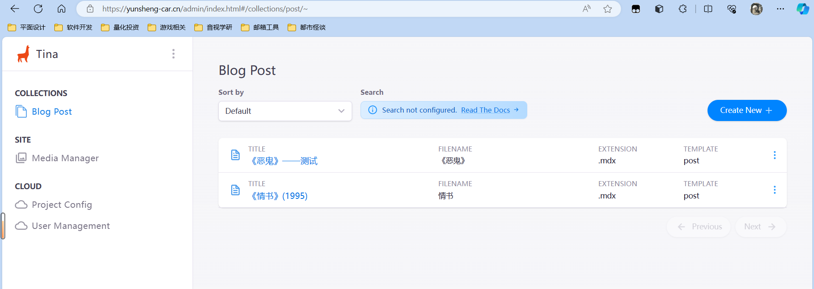

# 问题分析

网站地址：[Home • 云升的手推车 (yunsheng-car.cn)](https://yunsheng-car.cn/)

之前有过计划做一个用来个人记录生活（游记、影评等等）的网站，于是在上周周末的时候开始完成了这个网站，这次不想再用`Hexo`框架，想尝试一下新鲜的东西，于是选中了去年正式发布并迅速迭代的[Astro框架](https://docs.astro.build/zh-cn/getting-started/)（[2023Web框架性能报告](https://zhuanlan.zhihu.com/p/614425033)），并且这次直接采用Vercel部署，尝试引入CMS，原本以为有相关的技术经验，但是这次还是遇到了不少麻烦。

首先是`Astro`作为一款极新的前端框架，目前国内相关教程极少，较老框架来说门槛较高，好在有比较详尽的官方文档，基本还是可以自主解决问题。

其次是困扰最久的CMS（内容管理系统，方便编辑管理Web内容），由于`Astro`是新框架，与之相关的CMS文档就更少了，而且是全英文档，后续在打包的`package.json`配置文件和CMS相关配置以及`schema`等模块方面都花了较长的时间处理解决，最后才终于解决，并通过`TinaCMS Cloud`连接`GitHub`仓库实现生产模式部署。

# 前置工作

+ Node.js
+ TinaCMS
+ VS Code
+ GitHub
+ Vercel

# 过程重点

## Astro

`Astro`的基本构建是最简单的，参考`Astro`官方文档就可以简单地通过脚手架搭建，[入门指南 🚀 Astro 文档](https://docs.astro.build/zh-cn/getting-started/)，大多数资料都可以参考官方文档解决，完成简单的构建后的各种调试以及组件的引入、部署才是困难的地方。

## CDN

CDN和[这篇文章](https://blog-yunsheng.cn/2023/11/23/Vercel-CloudFlare实现近零成本Twikoo评论系统部署/)中的操作一直，已经踩过的坑后面就很难再踩了，照着完成即可。

## VS Code

`Astro`项目推荐用VS Code进行编写以及终端调试。

## TinaCMS

最折磨的地方，第一次尝试使用CMS，而且还是全英文的文档，需要慢慢啃，花了两天的时间才自己啃下来，目前已经实现了远程控制。

但是我还不知道该怎么记录这块，虽然我是都啃下来了，但是要写这块的实现的话可能得单独写一整篇文章，而且有些功能还没有完全实现，可能等以后更加熟悉了会专门记录一下。

基本原理是连接`GitHub`仓库，然后远程对`GitHub`存储库的内容进行管理。

# 后记

目前感受来看`Astro`框架确实比`Hexo`好很多，`Hexo`的优势似乎只剩下使用门槛低了，但后续的管理远不如`Astro`，大概到明年`Astro`更加成熟，并且我也对其更加熟练以后应该会把博客迁移过去。

后续想利用其做个个人简历使用，这个大概月底前完成吧，目前又要把精力回到毕设和竞赛上了。

这次的折腾其实收获很大，主要在于自主解决问题的能力得到了验证和提升，我觉得这是很重要的，以后总会遇到不会的事情，自己能不能够解决至关重要。
