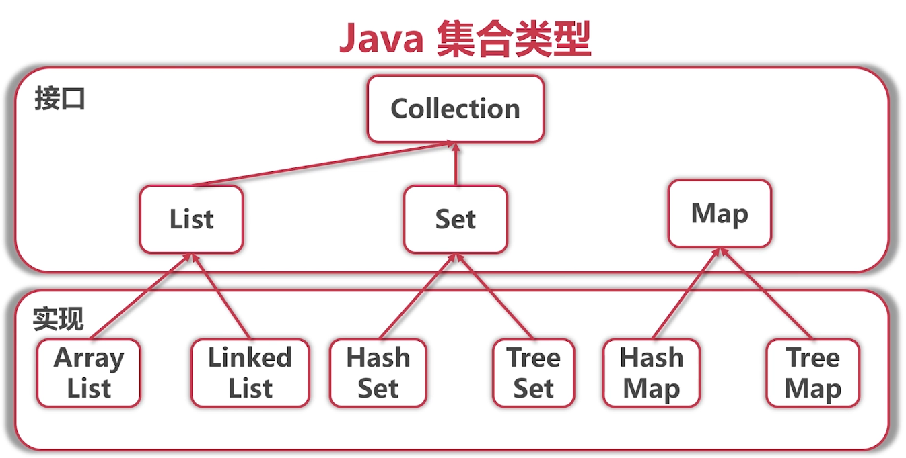

# 数据结构

## 列表

+ 数组
+ 链表
+ 队列，栈

## 树

+ 二叉树
+ 搜索树
+ 堆/优先队列

```java
push(1);push(3);push(2);pop();pop();pop();
栈：2; 3; 1
队列：1; 3; 2
优先队列：1; 2; 3
```

## 图

+ 无向图
+ 有向图
+ 有向无环图

***图的算法***

+ 深度优先遍历
+ 广度优先遍历
+ 拓扑排序
+ 最短路径/最小生成树

## Java集合类型



***ArrayList和LinkedList的区别***

都是线性表的结构，他们都是List接口，但是实现不同，ArrayList是数组实现，LinkedList是链表实现。

***HashMap和Hashtable的区别***

Hashtable是Java 1的遗留产物；

Hashtable不允许null；

Hashtable线程安全，因为所有危险函数都加了synchronized（一种同步锁），会让开销变得很大；

HashMap更快，想要线程安全用ConcurrentHashMap。

## 二叉树

+ 前序遍历
  + 先遍历树根
  + 前序遍历左子树
  + 前线遍历右子树
+ 中序遍历
  + 中序遍历左子树
  + 遍历树根
  + 中序遍历右子树
+ 后序遍历
  + 后序遍历左子树
  + 后序遍历右子树
  + 遍历树根

### 二叉树的性质

1. 非空二叉树上第k层上至多有$2^{k-1}$个结点（k>=1）
2. 高度为h的二叉树至多有$2^h-1$个结点（h>=1）
   + 满二叉树：高度为h的有$2^h-1$个结点（h>=1）的二叉树
   + 满二叉树：每一层有$2^{k-1}$个结点
3. 非空二叉树上的叶节点数等于度为2的结点数加1，即$n_0$=$n_2$+1
   + 设度为0，1，2的结点个数分别为$n_0,n_1,n_2$，结点总数$n=n_0+n_1+n_2$
4. 具有n个（n>0）结点的完全二叉树的高度为$log_2(n+1)$（n向上取整）或$log_2n+1$（n向下取整）

### 根据前序中序构造二叉树

前序：树根 + （左子树 + 右子树）

中序：（左子树） + 树根 + （右子树）

***递归思想，不停找树根，定左右子树，即可构造出二叉树！***

#### 二叉查找树和中序遍历

因为二叉查找树每一个左子树都比根小，每一个右子树都比根大，所以它的中序遍历序列是从小到大的。

### B/B+树

[一文彻底搞懂MySQL基础：B树和B+树的区别_mysql b树和b+树的区别-CSDN博客](https://blog.csdn.net/a519640026/article/details/106940115)

**m阶B/B+树**

+ 每个非叶子节点（除根外）至多有m个儿子，至少有[m/2]个儿子
+ 根节点（如果不是叶子）至少有两个儿子
+ 所有叶子节点在同一层

#### B/B+树的区别

B树的值可以出现在非叶子节点上，B+树真正有用的东西全在叶子节点上，它的根和非叶子节点作用在于帮助找到这个真正的数值所在的地方。

#### B树和二叉搜索树的区别

B树的每一个节点可以放更多的元素，可以有更多的儿子——为了优化磁盘的读写次数（磁盘存取次数与B树的高度成正比）。

### 红黑树

[【精选】【数据结构】史上最好理解的红黑树讲解，让你彻底搞懂红黑树_小七mod的博客-CSDN博客](https://blog.csdn.net/cy973071263/article/details/122543826)

## 进制转换

*例：13 --> 三进制 --> 111*

1 * 3 * 3 + 1 * 3 + 1 = 13

13 % 3 = 1         13 / 3 = 4

4 % 3 = 1            4 / 3 = 1

1 % 3 = 1            1 / 3 = 0

## 二进制运算

### 位运算

1. 与（&）（两位同时为 1，结果才为 1，否则为 0）

```
  1 0 0 1 1
& 1 1 0 0 1
------------------------------
  1 0 0 0 1
```

2. 或（|）（参加运算的两个位只要有一个为 1，其值为 1 ）

```
  1 0 0 1 1
| 1 1 0 0 1
------------------------------
  1 1 0 1 1
```

3. 异或（^）（参加运算的两个位只要不相同则为 1）

```
  1 0 0 1 1
^ 1 1 0 0 1
-----------------------------
  0 1 0 1 0
```

4. 取反（~）（0 则变为 1，1 则变为 0）

```
~ 1 0 0 1 1
-----------------------------
  0 1 1 0 0
```

**实例**

```
int a = 5; //二进制表示为 101
int b = 3; //二进制表示为 011
int c = a & b; //与运算，结果为 001，即 1
int d = a | b; //或运算，结果为 111，即 7
int e = a ^ b; //异或运算，结果为 110，即 6
int f = ~a; //取反运算，结果为 11111111111111111111111111111010，即-6
```

### 移位运算

位运算包括左移（<<）、右移（>>）以及无符号右移（>>> , 无符号右移就是右移之后，无 论该数为正还是为负，右移之后左边都是补上 0），它们分别将一个二进制数左移或右移一定 的位数。

```
int a = 5; //二进制表示为 101
int b = a << 1; //左移一位，结果为 1010，即 10
int c = a >> 1; //右移一位，结果为 10，即 2
int d = a >>> 1; //无符号右移一位，结果为 10，即 2
```

### 位运算赋值运算符

位运算赋值运算符（&=、|=、^=、<<=、>>=、>>>=）是将位运算结果赋值给左操作数的运算。

```
int a = 5; //二进制表示为 101
int b = 3; //二进制表示为 011
a &= b; //相当于 a = a & b 
a |= b; //相当于 a = a | b
a ^= b; //相当于 a = a ^ b
a <<= 1; //相当于 a = a << 1
a >>= 1; //相当于 a = a >> 1
a >>>= 1; //相当于 a = a >>> 1
```

# 操作系统

## 进程和线程

进程包含若干个线程、逻辑内存（不同进程间的内存相互独立——为了安全性）以及文件/网络句柄（不同进程所共有的，以打开同一个文件或抢同一个网络的端口）。

线程包含栈、PC（放在内存中；下一条执行指令的地址）以及TLS。

操作系统实际真正在运行的是一个一个的线程，进程只是一个容器。

[Java线程基本方法详解_java中线程相关的基本方法-CSDN博客](https://blog.csdn.net/shaomingmin/article/details/106180380)

*线程让步可以通过 yield ()方法来实现,该方法和 sleep ()方法有点相似,都可以让当前正在运行的线程暂停,区别在于 yield() 方法不会阻塞该线程,它只是将线程转换成就绪状态,让系统的调度器重新调度一次。当某个线程调用 yield ()方法之后,只有与当前线程优先级相同或者更高的线程才能获得执行的机会。*

**线程安全不安全的区别在于有没有加锁机制。**

## 存储

快	寄存器	贵

|            缓存           |

|            内存           |

慢	  硬盘	 便宜

## 寻址空间

进程里面指针能取到的地址的范围。

32位-->4G

64位-->~10^19Bytes

## 进程间通信

+ 文件
+ Signal               Linux上常见
+ 消息队列

[消息队列（定义、结构、如何创建、消息队列的发送与接收、发送与接收实例）_消息队列的数据结构_咋么又饿了的博客-CSDN博客](https://blog.csdn.net/scarificed/article/details/121475146)

[MQ（消息队列）功能介绍 - 简书 (jianshu.com)](https://www.jianshu.com/p/9a0e9ffa17dd)

+ 管道/命名管道

**匿名管道**

匿名管道主要用于本地父进程和子进程之间的通信，只支持半双工通信。

*第一：匿名管道只能实现本地进程之间的通信，不能实现跨网络之间的进程间的通信。*

*第二：匿名管道只能实现父进程和子进程之间的通信，而不能实现任意两个本地进程之间的通信。*

+ 共享内存
+ 同步机制，如信号量

信号量是一个计数器，可以用来控制多个进程对共享资源的访问。它常会被作为一种锁机制，用于防止某进程正在访问共享资源时，其他进程也来访问该资源。

+ Socket           重要

Socket 连接是计算机网络中的一种通信机制，它允许两个程序在不同计算机上通过网络进行通信。在使用套接字进行通信时，一个程序作为客户端，另一个程序作为服务器端，它们通过创建和使用套接字进行数据传输。我们可以将套接字理解为网络通信的接口，它提供了一种标准的通信方式，使得不同的程序能够在网络上进行数据交换。

在Socket 连接中，客户端程序首先会向服务器端发送一个连接请求，服务器端会接受这个连接请求，然后通过套接字与客户端进行通信。在通信过程中，客户端和服务器端通过套接字发送和接收数据。一旦通信完成，连接就会被断开，套接字也会被关闭。

（1）在计算机网络中，Socket 连接是一种重要的通信机制。它允许两个程序在不同计算机上进行实时通信，通过套接字的创建和使用来实现数据的传输。

（2）在 Socket 连接中，我们需要指定套接字的一些参数，例如 IP 地址、端口号、协议等等，以确保通信能够顺利进行。

（3）常见的协议有 TCP 和 UDP 两种，它们在数据传输的方式和效率上有所不同。

​        TCP 协议是一种可靠的协议，它保证数据在传输过程中不会丢失或损坏。TCP 协议通过连接的建立、数据的传输和连接的释放等步骤来保证数据的完整性和可靠性。TCP 协议适合于需要数据传输可靠性的场合，例如文件传输、网页浏览等。

​        UDP 协议是一种不可靠的协议，它不对数据传输的可靠性做出保证。UDP 协议的传输速度比 TCP 更快，但在传输过程中数据可能会丢失或损坏。UDP 协议适合于实时通信，例如视频和音频流的传输。

（4）Socket 连接被广泛应用于网络游戏、视频和音频流、文件传输、网络聊天、远程控制等方面。

## 中断

中断（interrupt）是指CPU对I/O设备发来的中断信号的一种响应。CPU暂停正在执行的程序，保存CPU现场环境后，自动转去执行该I/O设备的中断处理程序。执行完后再回到断点，继续执行原来的程序。陷入和陷阱（trap）时由CPU内部事件所引起的中断。中断和陷入的主要区别是信号的来源不同，即来自CPU外部（外中断或硬中断）还是CPU内部（内中断或软中断）。

## 同步

- 原子操作 (Atomic)。是指比如在一个原子操作哪检查和增加一个变量的值，中间不被打断。这保证了数据的完整性。但对于运行时长，其实没啥关系。
- 互斥锁 (Mutex)。互斥，就是我只让一个人干活，其他人都等着。然后这个人运行时间还长，占着这个锁不放，系统的性能就非常低了。因此互斥锁更好的用于运行时间较短的任务。
- 自旋锁 (SpinLock)。这个锁采用了不是被挂起，而是通过不断循环检查锁是否释放的机制。这个检查的过程是消耗CPU的。肯定只能适用于更短的任务。比如毫秒级。
- 信号量 (Semaphore)。信号量是所有这些同步元语中稍微复杂的一种。信号量确保了同时最多只能有n个人占着“坑”干活。相对来说，这里面的活可以干的久一点。

***同步和异步的区别***

同步就相当于是当客户端发送请求给服务端，在等待服务端响应的请求时，客户端不做其他的事情。当服务端做完了才返回到客户端。这样的话客户端需要一直等待。用户使用起来会有不友好。

异步就相当于当客户端发送给服务端请求时，在等待服务端响应的时候，客户端可以做其他的事情，这样节约了时间，提高了效率。

## Linux系统

[Linux命名空间概述](https://www.jianshu.com/p/2a14fe583cdf)

# 计算机网络

**五层协议的体系结构**

应用层

运输层

网络层

数据链路层

物理层

**OSI的体系结构**

应用层

表示层

会话层

运输层

网络层

数据链路层

物理层

## 网络传输

**不可靠**

+ 丢包，重复包
+ 出错
+ 乱序

**不安全**

+ 中间人攻击
+ 窃取
+ 篡改

## 滑动窗口

+ TCP协议
+ 维持发送方/接收方缓冲区

[计算机网络（7）——滑动窗口_接收窗口跟滑动窗口的区别-CSDN博客](https://blog.csdn.net/xiaojie_570/article/details/87904328)

能更好地利用带宽和流量控制。

## TCP协议

建立连接->三次握手:发[SYN];接[SYN, ACK];发[ACK]

断开连接->四次挥手:发[FIN];接[ACK];接[FIN];发[ACK]

[理解TCP序列号（Sequence Number）和确认号（Acknowledgment Number）_relative sequence number-CSDN博客](https://blog.csdn.net/a19881029/article/details/38091243)

Acknowledgment number：期待收到的包。

三次握手之后建立可靠的联系，可以发送HTTP协议。

+ 网络是不可靠的，任何包都有可能丢
+ 遇见问题，解决问题，不断迭代
+ 能用就好

#### TCP协议要达成什么目的？

TCP协议是一种基于连接的协议，在连接的基础上达到一种可靠的传输。可靠的传输指发包的顺序和收包的顺序是一样的、能够保证包不出错、流量控制（不会发得太快来不及收）、拥塞控制（网络出现拥塞的时候不会使情况进一步恶化）。

#### TCP协议如何做到流量控制、拥塞控制？

流量控制：滑动窗口

[计算机网络——TCP的拥塞控制（超详细） - 特务依昂 - 博客园 (cnblogs.com)](https://www.cnblogs.com/tuyang1129/p/12439862.html)

因为网络层不会提供拥塞的反馈信息，所以**TCP协议采用的是第一种方式——自己判断网络的拥塞情况**。当`TCP`检测到网络拥塞，则降低数据的发送速率，否则增加数据的发送速率。

#### TCP与UDP的区别

1. 基于连接与无连接；

2. 对系统资源的要求（TCP较多，UDP少）；

3. UDP程序结构较简单；

4. 流模式与数据报模式 ；

5. TCP保证数据正确性，UDP可能丢包；

6. TCP保证数据顺序，UDP不保证。

### 部分例题

1. TCP采用的滑动窗口大小为0是合法的。
2. 传输问题，已知距离、数据大小、要求时间、传输速率，问发送缓冲区最小设置大小
   + 一个来回的时间：       距离 / 传输速度 * 2
   + 来回的最多次数：       要求传输时间 / 一个来回的时间
   + 每次来回最少传输大小：         文件大小 / 来回的最多次数

## 帧同步

帧同步是通过在[数据传输](https://www.zhihu.com/search?q=数据传输&search_source=Entity&hybrid_search_source=Entity&hybrid_search_extra={"sourceType"%3A"answer"%2C"sourceId"%3A3134623660})过程中插入[同步字节](https://www.zhihu.com/search?q=同步字节&search_source=Entity&hybrid_search_source=Entity&hybrid_search_extra={"sourceType"%3A"answer"%2C"sourceId"%3A3134623660})或同步信号来保证数据的同步。

[【网络同步】浅析帧同步和状态同步 - 知乎 (zhihu.com)](https://zhuanlan.zhihu.com/p/357973435)

## DHCP与NAT的含义与作用

两个协议都是IP协议。

DHCP（[动态主机配置协议](https://gw-c.nowcoder.com/api/sparta/jump/link?link=https%3A%2F%2Fbaike.baidu.com%2Fitem%2F%E5%8A%A8%E6%80%81%E4%B8%BB%E6%9C%BA%E9%85%8D%E7%BD%AE%E5%8D%8F%E8%AE%AE%2F10778663)）是一个局域网的网络协议。指的是由服务器控制一段IP地址范围，客户机登录服务器时就可以自动获得服务器分配的IP地址和子网掩码。

NAT英文全称是“Network Address Translation”，中文意思是“网络地址转换”，它允许一个整体机构以一个公用IP地址出现在Internet上。

顾名思义，它是一种把内部私有网络地址（IP地址）翻译成合法网络IP地址的技术。简单的说，NAT就是在局域网内部网络中使用内部地址，而当内部节点要与外部网络进行通讯时，就在网关（可以理解为出口，打个比方就像院子的门一样）处，将内部地址替换成公用地址，从而在外部公网（internet）上正常使用，NAT可以使多台计算机共享Internet连接，这一功能很好地解决了公共IP地址紧缺的问题。

## 子网掩码

*例：A和B的IP地址分别为10.105.1.113和10.105.1.91，它们需要在一个子网中，求他们的子网掩码，选出不能使用的那个*

|                 | 10.105.1.113                        | 10.105.1.91                         |
| :-------------- | :---------------------------------- | ----------------------------------- |
|                 | 00001010.01101001.00000001.01110001 | 00001010.01101001.00000001.01011011 |
| 255.255.255.0   | 11111111.11111111.11111111.00000000 | 11111111.11111111.11111111.00000000 |
| 255.255.255.128 | 11111111.11111111.11111111.10000000 | 11111111.11111111.11111111.10000000 |
| 255.255.255.192 | 11111111.11111111.11111111.11000000 | 11111111.11111111.11111111.11000000 |
| 255.255.255.224 | 11111111.11111111.11111111.11100000 | 11111111.11111111.11111111.11100000 |

可知到255.255.255.224时不能使用，其实……根本不用算，这道题可以直接盲选嘛。

## SSH

[SSH简介及两种远程登录的方法_ssh @-CSDN博客](https://blog.csdn.net/li528405176/article/details/82810342)

Secure Shell(SSH) 是由 IETF(The Internet Engineering Task Force) 制定的建立在**应用层**基础上的安全网络协议。它是专为远程登录会话(甚至可以用Windows远程登录Linux服务器进行文件互传)和其他网络服务提供安全性的协议，可有效弥补网络中的漏洞。通过SSH，可以把所有传输的数据进行加密，也能够防止DNS欺骗和IP欺骗。还有一个额外的好处就是传输的数据是经过压缩的，所以可以加快传输的速度。目前已经成为Linux系统的标准配置。

SSH之所以能够保证安全，原因在于它采用了非对称加密技术(RSA)加密了所有传输的数据。

# 数据库

## 关系型数据库

+ 基于关系代数理论

+ 缺点：表结构不直观，实现复杂，速度慢
+ 优点：健壮性高，社区庞大

## 事务

**事务管理（ACID）**

+ 原子性（Atomicity）

原子性是指事务是一个不可分割的工作单位，事务中的操作要么都发生，要么都不发生。

+ 一致性（Consistency）

事务前后数据的完整性必须保持一致。

+ 隔离性（Isolation）

事务的隔离性是多个用户并发访问数据库时，数据库为每一个用户开启的事务，不能被其他事务的操作数据所干扰，多个并发事务之间要相互隔离。

+ 持久性（Durability）

持久性是指一个事务一旦被提交，它对数据库中数据的改变就是永久性的，接下来即使数据库发生故障也不应该对其有任何影响。

**事务的隔离级别**

+ Read uncommitted

读未提交，即一个事务可以读取另一个未提交事务的数据；并发操作会导致脏读。

+ Read Committed

读操作，即一个事务要等到另一个事务提交后才能读取数据；解决脏读问题；并发操作会导致不可重复读。

+ Repeatable Reads

重复读，即开始读取数据（事务开启）时，不再允许修改操作；解决不可重复读问题；并发操作会导致幻读（对应insert操作）。

+ Serializable

序列化，最高的事务隔离级别，该级别下，事务串行化顺序执行；避免脏读、不可重复读与幻读；但是该级别效率低下，比较消耗数据库性能，一般不用。

## 乐观锁

乐观锁假设认为数据一般情况下不会造成冲突，所以在数据进行提交更新的时候，才会正式对数据的冲突与否进行检测，如果发现冲突了，则让返回用户错误的信息，让用户决定如何去做。

+ 读取数据，记录Timestamp
+ 修改数据
+ 检查和提交数据

[MySQL数据库的锁 --- 六种分类 - 14种锁详细介绍_mysql 数据库锁-CSDN博客](https://blog.csdn.net/Dhaihaihai/article/details/110454553)

*重点看粒度*

## 范式

[什么是第一，第二，第三范式_第一范式第二范式第三范式的定义-CSDN博客](https://blog.csdn.net/xidianliuy/article/details/51566576)

第一范式：简单说 列不能再分

第二范式：简单说 建立在第一范式基础上，消除部分依赖

第三范式：简单说 建立在第二范式基础上，消除传递依赖。

## 索引

[【精选】MySQL 数据库--索引（理论详解及实例演示）_https://blog.csdn.net/weixin_51486343/article/deta-CSDN博客](https://blog.csdn.net/weixin_51486343/article/details/113351092)

最好把要查的字段都加上索引，不然会很慢，怎么知道有没有索引呢？用EXPLAIN去看，看type，ref就是对的。

主键和外键会自动建索引，自己把要查的数据量大的字段加上索引。

### 索引的实现

+ B树
+ B+树
+ 二叉树优先**比较**次数，B/B+树优化**磁盘**读写次数

#### 数据库索引的作用

+ 加快查找速度
+ 约束数据的值

#### 数据库索引的分类

[浅谈 MySQL 索引的分类 - 知乎 (zhihu.com)](https://zhuanlan.zhihu.com/p/338629505)

## 数据库的连接池

+ 建立连接要花很多时间
+ 每个用户建立连接造成浪费

## 内连接和外连接

[数据库-内连接与外连接的区别(举例说明)_数据库内连接和外连接的区别举例-CSDN博客](https://blog.csdn.net/dove_knowledge/article/details/71420206)

**内连接：**

取出两张表中匹配到的数据，匹配不到的不保留。

**外连接：**

取出连接表中匹配到的数据，匹配不到的也会保留，其值为NULL。

**外连接的分类：**

左外连接，右外连接，全外连接

## 当前读和快照读

+ 当前读：每次读取的都是当前最新的数据，但是读的时候不允许写，写的时候也不允许读。

+ 快照读：读写不冲突，每次读取的是快照数据，
  + 隔离级别Repeatable Read下（默认隔离级别）：有可能读取的不是最新的数据
  + Read Committed隔离级别下：快照读和当前读读取的数据是一样的，都是最新的。

### 当前读

Mysql实现当前读是通过共享锁+排他锁+Next-Key Lock实现的。

+ 每次对行数据进行读取的时候，加共享锁。此时就不允许修改，但是允许其他事务读取，所以每次都可以读到最新的数据。
+ 每次对行数据进行修改的时候，加排他锁，不允许其他事务读取和修改。这种情况下其他事务读取的数据也一定是最新的数据。
+ 每次对范围行数据进行读取的时候，对这个范围加一个范围共享锁。
+ 每次对范围行数据进行修改的时候，读这个范围加一个范围排它锁。

基于上述锁机制，实现当前读，确保每次读取的都是最新的数据。

### 快照读

mysql中的快照读是通过MVCC+undolog实现的。
快照读，顾名思义，就是读取快照数据，也就是说当某个数据正在被修改的时候，也可以进行读取该数据，保证读写不冲突。
刚刚提到undolog，当我们对记录做了变更操作时，就会产生undo记录，undo记录中存储的是老版数据，当一个旧的事务需要读取数据时，为了能够读取到老版本的数据，需要顺着undo列找到满足其可见性的记录，这个找满足可见行的记录依赖。就是说每次都是读取undolog中的数据。

***MVCC***

MVCC也称多版本并发控制，说的通俗易懂一点就是记录数据的不同版本。
实际上，不同事务或者相同事务的对同一记录的修改，会导致该记录的undo log成为一条记录版本线性表，既链表，undo log的链首就是最新的旧记录，链尾就是最早的旧记录。
所以快照读都是去读取undolog中链首的最新的旧记录。

***undolog***

在操作数据之前,把需要操作的数据和事务记录备份到undo log中,目的就是为了保证原子性，如果一个事务执行中发生了故障，就可以通过undolog进行回滚。

## 常见问题

***介绍一下关系型数据库的理论基础***

基于关系代数理论，一到五范式。

***给定一个场景，请设计表结构***

至少到三范式

***如何生成安全且不易重复的数据库ID？***

[如何生成安全且不易重复的数据库ID？_生成不重复id_谢少迪的博客-CSDN博客](https://blog.csdn.net/youngerxsd/article/details/131001528#:~:text=使用自增主键可能会暴露数据库信息，采用随机数生成id%2C而使用随机数作为ID有重复的风险，下面我提供一些建议。 1、UUID（通用唯一识别码）%3A,可以考虑使用UUID作为主键。 UUID是一个128位的数字，其生成算法旨在确保在不同计算机和时间上生成的ID具有极低的重复概率。)

# 程序设计与算法

## 归类

### 类型检查

+ 编译时：C，C++，Java，GO
+ 运行时：Python，Perl，JavaScript，Ruby

### 运行/编译

+ 编译为机器代码运行：C，C++

速度快

+ 编译为中间代码，在虚拟机运行：Java，C#

提供程序跨平台的能力

+ 解释执行：Python，Perl，JavaScript

不需要编译，看到一行代码就运行一行代码

### 编程范式（Programming Paradigm）

+ 面向过程：C，Visual Basic
+ 面向对象：Java，C#，C++，Scala
+ 函数式：Haskell，Erlang

#### 常见问题

***比较一下Java和C++语言***

***介绍一下面向对象思想***

***介绍一下函数式编程，函数式编程和函数指针的区别***

## Java创建对象的几种方式

[【面试题】Java中创建对象的方式有几种？_创建对象的方式有哪些 面试题-CSDN博客](https://blog.csdn.net/Yearingforthefuture/article/details/115843044)

## Java IO

Java 把 Input输入流 和 Output 输出流，统称为IO流，它的核心就是对文件的操作，对于 字节 、字符类型的输入和输出。

IO流主要分为两大类，字节流和字符流。字节流可以处理任何类型的数据，如图片，视频等，字符流只能处理字符类型的数据。

IO流的本质是数据传输，并且流是单向的。

[Java——IO流超详细总结 - 说故事的五公子 - 博客园 (cnblogs.com)](https://www.cnblogs.com/wugongzi/p/12092326.html)

[Java IO学习整理 - 知乎 (zhihu.com)](https://zhuanlan.zhihu.com/p/25418336)

## 数据类型

### 整数类型

**32位int的范围**

-2^31 ~ 2^31-1

**补码**

*取反加1*

+ 符号位可以和数值位一起参加运算
+ 可以直接利用加法的形式计算整数间的减法

+ 唯一表示0，没有+0，-0
+ 总共表示2^32个数

### 浮点数与定点数

64位double范围：+/-10^308

64位double精度：10^15

**浮点数比较**

因为精度问题，直接比较经常出错，常用`Math.abs(a - b) < eps ?`来判断

使用BigDecimal算钱

### Java数据类型

+ primitive type: int, long, float ...
  + 值类型
  + 用`a == b`来判断值相等

+ Object: Integer, Long, Float, String ...
  + 引用类型
  + 用`a == b`判断是否为同一个Object
  + 用`a.equals(b)`或`Object.equals(a, b)`判断是否相等

#### 什么是值传递，什么是引用传递

在Java里面primitive type之间就是值传递，Object之间就是引用传递。

在C++里面值传递和引用传递由程序员说了算。

#### String s = new String("test");创建了多少对象

两个对象。

#### equals和hashCode的关系

hashCode相等不一定equal，但equal一定hashCode相等。

#### 什么是序列化和反序列化

当我们把内存中的对象转成字节流就是序列化，反序列化就是把字节流还原成原来的对象放进内存。

### 装箱和拆箱

```java
Integer a = 2; // Boxing
Integer b = new Integer(2); // Boxing
int v = a.intValue(); // Unboxing
```

```java
new Integer(2) == 2; // true-->编译的时候会自动帮我们拆箱
new Integer(2) == new Integer(2); // false
Integer.valueOf(2) == Integer.valueOf(2); // true 数值比较小的时候会分配到同一个箱子，但是当数值比较大的时候可能不会分配到同一个箱子，即可能true可能false
Integer.valueOf(2).intValue() == 2; // true
new Integer(2).equals(new Integer(2)); // true
```

## 面向对象

[面向对象编程三大特性------封装、继承、多态_面向对象，封装继承多态-CSDN博客](https://blog.csdn.net/jianyuerensheng/article/details/51602015)

就是分析出解决问题所需要的步骤，然后用函数把这些步骤一步一步实现，使用的时候一个一个依次调用就可以了。

*从用户（终端用户，使用代码的用户）的角度思考问题，摈弃完全基于逻辑的思维。（易读性）*

**封装**

系统的其他对象只能通过包裹在数据外面的已经授权的操作来与这个封装的对象进行交流和交互。也就是说用户是无需知道对象内部的细节，但可以通过该对象对外的提供的接口来访问该对象。

对于封装而言，一个对象它所封装的是自己的属性和方法，所以它是不需要依赖其他对象就可以完成自己的操作。

1、良好的封装能够减少耦合。

2、类内部的结构可以自由修改。

3、可以对成员进行更精确的控制。

4、隐藏信息，实现细节。

*尽量只使用`private`和`public`*

**继承**

继承是使用已存在的类的定义作为基础建立新类的技术，新类的定义可以增加新的数据或新的功能，也可以用父类的功能，但不能选择性地继承父类。

1、子类拥有父类非private的属性和方法。

2、子类可以拥有自己属性和方法，即子类可以对父类进行扩展。

3、子类可以用自己的方式实现父类的方法。。

**多态**

一个引用变量倒底会指向哪个类的实例对象，该引用变量发出的方法调用到底是哪个类中实现的方法，必须在由程序运行期间才能决定。

Java实现多态有三个必要条件：继承、重写、向上转型。

### 不可变性

***`final`关键字***

+ 类声明-->类不可以被继承
+ 函数声明-->函数不可以在派生类中重写
+ 变量声明-->变量不可以指向其他对象

***不可变性的实现***

+ `final`关键字无法保证不可变性
+ 从接口定义，类的实现上保证不可变性

### 类与对象

+ 类的成员变量-->对象状态
+ 类的成员函数-->对象行为
+ 类的静态变量

没有this引用，全局变量。

+ 类的静态函数

普通函数可以引用静态变量、静态函数。

静态函数引用普通成员变量、函数是编译错误的。

对象上引用静态变量、函数会被编译器警告。

**类的特殊函数**

+ 构造函数
+ equals
+ hashCode
+ toString

### 接口与抽象类

接口里面定义了很多函数，但是他们没有实现，这个就叫接口，它做到了一个合约的作用，明确对象需要满足什么样的要求。

***为什么要有接口的概念***

从用户（使用实现的代码）角度看问题，用户不需要关心它是怎么实现的。

***接口与类相比***

+ 由编译器强制的一个模块间协作的合约（Contract）；
+ 无成员变量；
+ 成员函数只能申明不能有实现。

***接口的申明***

+ Java：interface BankEndPoint {...}
+ C++：一个全部是纯虚函数的类
+ Python/大部分动态语言：依靠注释申明

***接口和抽象类的区别***

**从实现角度看**

抽象类可以有成员变量

抽象类可以有部分实现

抽象类不可以多重继承，接口可以

***父类/子类的实例化/析构顺序***

实例化顺序为先父类再子类，析构反之。

***final(Java)和const(C++)的作用***

final可以用在变量上也可以用在方法、类上。

[C语言中const关键字的用法-CSDN博客](https://blog.csdn.net/xingjiarong/article/details/47282255)

***虚函数与纯虚函数***

[C++ 虚函数和纯虚函数的区别 | 菜鸟教程 (runoob.com)](https://www.runoob.com/w3cnote/cpp-virtual-functions.html)

虚函数：它虚就虚在所谓"推迟联编"或者"动态联编"上，一个类函数的调用并不是在编译时刻被确定的，而是在运行时刻被确定的。由于编写代码的时候并不能确定被调用的是基类的函数还是哪个派生类的函数，所以被称为"虚"函数。虚函数只能借助于指针或者引用来达到多态的效果。

纯虚函数是在基类中声明的虚函数，它在基类中没有定义，但要求任何派生类都要定义自己的实现方法。纯虚函数的声明就是在告诉子类的设计者，"你必须提供一个纯虚函数的实现，但我不知道你会怎样实现它"。

***多重继承***

C++允许多重继承，Java不允许，但实现接口可以。

#### Iterable接口

[【Java】Iterable接口的使用_iterable的用法_何为xl的博客-CSDN博客](https://blog.csdn.net/weixin_43848614/article/details/114601737)

### 泛型

[JAVA中泛型和Object的区别_使用范型和object的区别-CSDN博客](https://blog.csdn.net/qq_33537014/article/details/80575033)

`ArrayList<Integer>`是`List<Integer>`

`List<Integer>`不是`List<Object>`

```java
// 把List<Integer>转换成List<Object>
// 1.
new ArrayList<Object>(intList);
// 2.能运行，但危险！
(List<Object>)(List)intList;
```

#### C++中的虚函数表

[C++虚函数表剖析 | Leo的技术分享 (leehao.me)](https://leehao.me/C-虚函数表剖析/)

Java里所有的函数都相当于C++里的虚函数。

*理解指针的指向，引用的对象，vtable->虚函数表，在其中找到虚函数。*

## 程序编码

***数学归纳法（俗称……找规律，显然法，高数里高阶函数问题常用的方法，这里用来推程序正确性）***

用于证明断言对所有自然数成立

+ 证明对于N=1成立
+ 证明N>1时：如果对于N-1成立，那么对于N成立

### 递归控制

***要点***

+ 严格定义递归函数的作用，包括参数、返回值、Side-effect
+ 先写**一般**情况，后写**特殊**情况
+ 每次调用**必须**缩小问题规模
+ 每次问题规模缩小程度必须为**1**

**不要尝试递归改非递归**

+ 一般化的方法仍需要使用栈
+ 代码复杂
+ 不能根本解决问题

### 循环控制

***循环不变式***

是一句断言定义各变量所满足的条件，说人话就是变量进入循环必须满足的条件。

***循环书写方法***

+ 定义循环不变式，并在循环体每次结束后保持循环不变式
+ 先一般，后特殊
+ 每次必须向前推进循环不变式中涉及的变量值
+ 每次推进的规模必须为1

### 边界控制

凭经验。

## 静态绑定与动态绑定

[java的动态绑定与静态绑定(彻底理解多态与重载)-CSDN博客](https://blog.csdn.net/Untara/article/details/100115150)

静态绑定是发生在编译阶段；而动态绑定是在运行阶段；

重载方法(overloaded methods)使用的是静态绑定，而重写方法(overridden methods)使用的是动态绑定

## 常见问题

***如何判断对象已死亡***

[【JAVA】如何判断对象已经死亡？_java 如何判断对象已经“死去”-CSDN博客](https://blog.csdn.net/qq_33591903/article/details/82107686)

1. 引用计数法

程序给对象添加一个引用计数器，每有一个变量引用它时，计数器加1。当引用断开时，计数器减1。当计数器为0时，代表着没有任何变量引用它，该对象就是死亡状态，JVM需要对此类对象进行回收。

2. 可达性分析法

程序创建一系列的GC Roots作为起始点，从这些节点开始向下搜索，搜索所走过的路径称为引用链，当一个对象与GC Roots没有任何引用链相连的话，即此对象到GC Roots不可达，则证明此对象是不可用的，JVM稍后将会对此类对象进行回收。

***web开发安全问题***

[web开发常见的几大安全问题 - 知乎 (zhihu.com)](https://zhuanlan.zhihu.com/p/113179679#:~:text=web开发常见的几大安全问题 1 1、涉及到私密信息 使用post请求，因为信息放在请求体中而不像get请求暴露在url上 2 2、HTTPS。 ... 3,XSS。 ... 7 7、点击劫持，点击劫持是一种视觉欺骗的攻击手段。 ... 8 8、URL跳转漏洞，借助未验证的URL跳转，将应用程序引导到不安全的第三方区域，从而导致的安全问题。 更多项目)

# 设计模式

**单例模式**

+ 确保全局至多只有一个对象
+ 用于：构造缓慢的对象，需要统一管理的资源
+ 缺点：很多全局状态，线程安全性

实现的方法为先判断实例存在与否，如果存在则直接返回，如果不存在就创建了再返回，这就确保了一个类只有一个实例对象

**工厂模式**

工厂模式通常会分成3个角色：

- 工厂角色-负责实现创建所有实例的内部逻辑
- 抽象产品角色-是所创建的所有对象的父类，负责描述所有实例所共有的公共接口
- 具体产品角色-是创建目标，所有创建的对象都充当这个角色的某个具体类的实例

**观察者模式**

观察者模式是一种行为型设计模式，它定义了一种一对多的依赖关系，当一个对象的状态发生改变时，其所有依赖者都会收到通知并自动更新。

当对象间存在一对多关系时，则使用观察者模式（Observer Pattern）。比如，当一个对象被修改时，则会自动通知依赖它的对象。观察者模式属于行为型模式。

# 暂未分类

## 分布式

[大白话告你什么是分布式，史上最全详解！ - 知乎 (zhihu.com)](https://zhuanlan.zhihu.com/p/382966178)

## 分布式ID

***全局唯一性***

不能出现有重复的ID标识，这是基本要求。

***递增性***

确保生成ID对于用户或业务是递增的。

***高可用性***

确保任何时候都能生成正确的ID。

***高性能性***

在高并发的环境下依然表现良好。

### UUID

Java自带的生成一串唯一随机36位字符串（32个字符串+4个“-”）的算法。它可以保证唯一性，且据说够用N亿年，但是其业务可读性差，无法有序递增。

### 雪花算法

Twitter开源的由64位整数组成分布式ID，性能较高，并且在单机上递增。 

[面试官：讲讲雪花算法，越详细越好 - 知乎 (zhihu.com)](https://zhuanlan.zhihu.com/p/433690272)

## MVC

[基础 | 三层架构与MVC模式 - 知乎 (zhihu.com)](https://zhuanlan.zhihu.com/p/101038664)

**MVC模式**是软件工程中常见的一种软件架构模式，该模式把软件系统（项目）分为三个基本部分：**模型（Model）、视图（View）和控制器（Controller）。**

使用MVC模式有很多优势，例如:简化后期对项目的修改、扩展等维护操作；使项目的某一部分变得可以重复利用；使项目的结构更加直观。

具体来讲，MVC模式可以将项目划分为模型（M）、视图（V）和控制器（C）三个部分，并赋予各个部分不同的功能，方便开发人员进行分组。

## 设计原则

[六大设计原则超详细介绍（再不理解你打我） - 知乎 (zhihu.com)](https://zhuanlan.zhihu.com/p/110130347)

1. 单一职责原则：一个类或接口只承担一个职责。
2. 里氏替换原则：在继承类时，务必重写（override）父类中所有的方法，尤其需要注意父类的protected方法（它们往往是让你重写的），子类尽量不要暴露自己的public方法供外界调用。
3. 依赖倒置原则：高层模块不应该依赖于低层模块，而应该依赖于抽象。抽象不应依赖于细节，细节应依赖于抽象。
4. 接口隔离原则：不要对外暴露没有实际意义的接口。
5. 迪米特法则：尽量减少对象之间的交互，从而减小类之间的耦合。
6. 开闭原则：对软件实体的改动，最好用扩展而非修改的方式。

## 深拷贝与浅拷贝

浅拷贝只复制指向某个对象的指针，而不复制对象本身，相当于是新建了一个对象，该对象复制了原对象的指针，新旧对象还是共用一个内存块。

深拷贝是新建一个一模一样的对象，该对象与原对象不共享内存，修改新对象也不会影响原对象。

## GC

[【JAVA核心】Java GC机制详解-CSDN博客](https://blog.csdn.net/laomo_bible/article/details/83112622)

程序运行时，内存空间是有限的，那么如何及时的把不再使用的对象清除将内存释放出来，这就是GC要做的事。

需要进行回收的对象就是已经没有存活的对象，**判断一个对象是否存活**常用的有两种办法：引用计数和可达分析。

(1)程序调用System.gc时可以触发

(2)系统自身来决定GC触发的时机（根据Eden区和From Space区的内存大小来决定。当内存大小不足时，则会启动GC线程并停止应用线程）

主要做了清理对象，整理内存的工作。

标记-清除算法，标记-压缩算法，复制算法，分代收集算法。

[新一代垃圾回收器ZGC的探索与实践 - 美团技术团队 (meituan.com)](https://tech.meituan.com/2020/08/06/new-zgc-practice-in-meituan.html)

与CMS中的ParNew和G1类似，ZGC也采用标记-复制算法，不过ZGC对该算法做了重大改进：ZGC在标记、转移和重定位阶段几乎都是并发的，这是ZGC实现停顿时间小于10ms目标的最关键原因。

## Redis

[Redis【入门】就这一篇！ - 知乎 (zhihu.com)](https://zhuanlan.zhihu.com/p/37982685)

NoSQL是一种**基于内存的数据库**，并且提供一定的持久化功能。Redis的性能十分优越，可以**支持每秒十几万此的读/写操作**，其性能远超数据库，并且还**支持集群、分布式、主从同步等**配置，原则上可以无限扩展，让更多的数据存储在内存中，更让人欣慰的是它还**支持一定的事务能力**，这保证了高并发的场景下数据的安全和一致性。

Redis 在 Java Web 主要有两个应用场景：

- 存储 **缓存** 用的数据；
- 需要高速读/写的场合**使用它快速读/写**；

[Redis是什么？看这一篇就够了 - 葡萄城技术团队 - 博客园 (cnblogs.com)](https://www.cnblogs.com/powertoolsteam/p/redis.html)

相比于其他数据库类型，Redis具备的特点是：

- C/S通讯模型
- 单进程单线程模型
- 丰富的数据类型
- 操作具有原子性
- 持久化
- 高并发读写
- 支持lua脚本

Redis 的应用场景包括：缓存系统（“热点”数据：高频读、低频写）、计数器、消息队列系统、排行榜、社交网络和实时系统。

Redis提供的数据类型主要分为5种自有类型和一种自定义类型，这5种自有类型包括：String类型、哈希类型、列表类型、集合类型和顺序集合类型。

[什么是Redis？简述它的优缺点？_redis介绍和优缺点_SONNIE在路上的博客-CSDN博客](https://blog.csdn.net/qq_44469202/article/details/115496920)

***Redis的特点***

[【精选】简述redis特点及其应用场景-CSDN博客](https://blog.csdn.net/qq_29974229/article/details/121673809)

***Redis的一些问题***

[【面试】redis缓存穿透、缓存击穿、缓存雪崩区别和解决方案-CSDN博客](https://blog.csdn.net/fcvtb/article/details/89478554)

1. 缓存穿透是指**缓存和数据库中都没有的数据**，而用户不断发起请求。由于缓存是不命中时被动写的，并且出于容错考虑，如果从存储层查不到数据则不写入缓存，这将导致这个不存在的数据每次请求都要到存储层去查询，失去了缓存的意义。

​	**接口层增加校验**，如用户鉴权校验，id做基础校验

2. **缓存击穿是指缓存中没有但数据库中有的数据（一般是缓存时间到期）**，这时由于并发用户特别多，同时读缓存没读到数据，又同时去数据库去取数据，引起数据库压力瞬间增大，造成过大压力。

​	**接口限流与熔断，降级**

​	**设置热点数据永远不过期**

​	**加互斥锁**

3. **缓存雪崩是指缓存中数据大批量到过期时间**，而查询数据量巨大，引起数据库压力过大甚至down机。和缓存击穿不同的是，        缓存击穿指并发查同一条数据，缓存雪崩是不同数据都过期了，很多数据都查不到从而查数据库。

​	缓存数据的过期时间设置随机，防止同一时间大量数据过期现象发生。

​	如果缓存数据库是分布式部署，将热点数据均匀分布在不同搞得缓存数据库中。

​	设置热点数据永远不过期。

## JVM中导致OOM的原因与解决

[1篇文章搞清楚8种JVM内存溢出（OOM）的原因和解决方法-阿里云开发者社区 (aliyun.com)](https://developer.aliyun.com/article/726472)

1. 堆溢出
2. 永久代/元空间溢出
3. 方法栈溢出
4. 非常规溢出
5. swap溢出
6. 本地方法溢出

## 字节对齐

*例：*

```
class` `A {
  ``int` `a;
  ``short` `b;
  ``int` `c;
  ``char` `d;
};
class` `B {
  ``double` `a;
  ``short` `b;
  ``int` `c;
  ``char` `d;
};
```

*在32位机器上用gcc编译以上代码，求sizeof(A)，sizeof(B)分别是（）*

``` 
A ----->   △△△△||△△==||△△△△||△=== 

B ----->  △△△△△△△△||△△==(short)△△△△(int)||△======= 
```

其中△为数据存储，=为填充

A: int a    （4个字节）                         4 

short b   (2个字节，起始地址4是2的倍数，不补)    4+2

int c     (4个字节，4+2不是4的倍数，补2个 )    4+2+2（补）+4

char d    (1个字节，4+2+2+4是1的倍数，不补)  4+2+2（补）+4 +1

最后补3个字节，让整体大小为4的倍数   4+2+2(补)+4+1+3（补） =16 

B: double a    （8个字节）                         8  

short b   (2个字节，起始地址8是2的倍数，不补)    8+2

int c     (4个字节，8+2不是4的倍数，补2个 )    8+2+2（补）+4

char d    (1个字节，8+2+2+4是1的倍数，不补)  8+2+2（补）+4 +1
最后补7个字节，让整体大小为8的倍数   8+2+2(补)+4+1+7（补） =24  

**总结**

1. 结构体变量的首地址 必须 是内部最宽数据类型的倍数
2. 按顺序一个变量一个变量看，要求current变量的首地址 必须是自己大小的倍数。 
3. 到了最后一个变量，要求整个结构体的大小的最宽数据类型的倍数。 

## 推荐算法

[[毕业设计\]电商大数据的商品推荐系统_电商商品推荐怎么实现的_HaiLang_IT的博客-CSDN博客](https://blog.csdn.net/qq_37340229/article/details/128040139#:~:text=常见的推荐算法思路 1 基于商品相似度：比如食物A和食物B，对于它们价格、味道、保质期、品牌等维度，可以计算它们的相似程度，可以想象，我买了包子，很有可能顺路带一盒水饺回家。 ... 2,基于关联规则：最常见的就是通过用户购买的习惯，经典的就是“啤酒尿布”的案例，但是实际运营中这种方法运用的也是最少的，首先要做关联规则，数据量一定要充足，否则置信度太低，当数据量上升了，我们有更多优秀的方法，可以说没有什么亮点，业内的算法有apriori、ftgrow之类的 ... 3 基于物品的协同推荐：假设物品A被小张、小明、小董买过，物品B被小红、小丽、小晨买过，物品C被小张、小明、小李买过；直观的看来，物品A和物品C的购买人群相似度更高（相对于物品B），现在我们可以对小董推荐物品C，小李推荐物品A，这个推荐算法比较成熟，运用的公司也比较多 ... 更多项目)

## 排序算法

1. 算法复杂度与初始状态无关的有：选择排序、堆排序、归并排序、基数排序；
2. 元素总比较次数与初始状态无关的有：选择排序、基数排序；
3. 元素总移动次数与初始状态无关的有：归并排序、基数排序。

### 简单排序算法

#### 插入排序

就像扑克牌一张张排序一样，我们每次从牌堆摸一张牌到手上，就把牌插入相应的位置。

~~~
for (int i = 0; i < a.length; i++) {
  for (int j = i; j > 0 && a[j] < a[j - 1]; j--) {
    swap(a, j, j - 1);
  }
}
~~~

#### 选择排序

我们考虑桌上有一堆面相上的明牌，我们要排序的话，通常会先选择A，然后选择2,3…K，完成排序。选择排序就是这样，每次从数组中剩下的元素中选择最小的那个即可。

~~~
for (int i = 0; i < a.length; i++) {
  // a[0...i)为原数组中最小的i个元素排序完成的结果
}
~~~

#### 冒泡排序

~~~
for (int i = 0; i < a.length; i++) {
  for (int j = a.length - 1; j > i; j--) {
    if (a[j] < a[j - 1]) {
      swap(a, j, j - 1);
    }
  }
}
~~~

在里层的for里面，我们j是**反向**移动的，这个非常重要。每次这样反向比较+交换一轮之后，我们总能保证剩下的数据中最小的数被换到a[i]的位置，这个交换的过程就像在模拟气泡在水中慢慢升起的过程。

### 高效排序算法

平均复杂度为O(nlogn)的算法。

#### 快速排序

快速排序和归并排序更是“分治”思想方法的典型体现。

~~~
void sort(int[] a) {
  // 分组：扫描a，把比a[0]小的数移到左边，把比a[0]大的数移到a[0]右边。
  // 递归：对于左右两半边分别递归调用sort
}
~~~

#### 归并排序

~~~
void sort(int[] a) {
  // 分组：把a分成左右两边，这次我们不管数据大小，直接中间切一刀，分组就完成了
  // 递归：把左右两边分别递归调用归并排序，获得两个排好序的子数组
  // 归并：把两个排好序的子数组进行归并
}
~~~

**把问题分成（若干个）互相独立的子问题，分别解决它们，并把子问题的解合成最终解**。

#### 堆排序

1. 所有数据建堆
2. 不断从堆中取出一个元素，重复n次。由于堆中取出的总是最小元素，因此排序完成。

### 非基于比较的排序算法

#### 计数排序

我们考虑一个问题，如果我告诉你我们所有的数据都是0-100的范围内的整数，但是数据的个数非常大，我们如何来排序呢？我们这样来做

1. 分别数一下有几个0，有几个1，几个2。。。
2. 计算累进的计数c，c[i]为<=i的个数。比如有2个0，3个1，那么c[0]=2, c[1]=5
3. 这个累进的计数c有一个重要的特点，数值为i的数在排好序的数组中位于[ c[i-1]…c[i] )
4. 利用这个累进计数的特点，可以重建出排序结果

#### 桶排序

扫描数据，放在自己建立的对应的“桶”里。

#### 基数排序

根据位数来排序，不需要像桶排一样人为指定桶。

比如

~~~
原始数据：       10,21,17,34,44,11,654,123
根据个位数排序：  10,21,11,123,34,44,654,17
根据十位数排序：  10,11,17,21,123,34,44,654
根据百位数排序：  10,11,17,21,34,44,123,644
~~~

### 总结

| 算法     | 平均时间复杂度 | 最好时间复杂度 | 最坏时间复杂度 | 空间复杂度 | 稳定性 |
| :------- | :------------- | :------------- | :------------- | :--------- | :----- |
| 插入排序 | n2             | n              | n2             | 1          | 稳定   |
| 选择排序 | n2             | n2             | n2             | 1          | 不稳定 |
| 冒泡排序 | n2             | n              | n2             | 1          | 稳定   |
| 快速排序 | nlogn          | nlogn          | n2             | logn       | 不稳定 |
| 归并排序 | nlogn          | nlogn          | nlogn          | n          | 稳定   |
| 堆排序   | nlogn          | nlogn          | nlogn          | 1          | 不稳定 |
| 计数排序 | n+s            |                |                | n+s        | 稳定   |
| 桶排序   | n+s            |                |                | n+s        | 稳定   |
| 基数排序 | dn             |                |                | n          | 稳定   |
